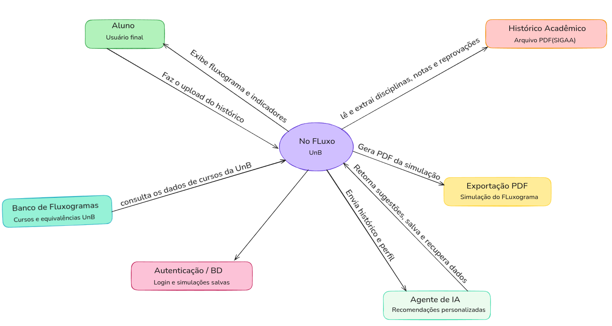

# 3. Tipo de Produto e Descrição do Software

Para classificar o **No Fluxo**, é possível utilizar duas óticas complementares: o modelo de negócio e o domínio de aplicação.

---

## 3.1 Classificação por Modelo de Negócio: Produto de Software Sob Demanda (Bespoke Software)

O No Fluxo se enquadra na categoria de **software desenvolvido sob demanda** (*bespoke software*), pois foi construído para atender a uma necessidade específica de um grupo de usuários bem delimitado: os estudantes de graduação da Universidade de Brasília (UnB). Diferentemente de um produto COTS de uso geral, a plataforma é projetada para operar com os dados e regras acadêmicas particulares da UnB — como o fluxograma de cada curso, o cálculo do IRA (Índice de Rendimento Acadêmico) e as equivalências entre disciplinas —, tornando-a intrinsecamente vinculada ao contexto institucional da universidade.

O sistema é disponibilizado como uma **aplicação web de acesso gratuito**, hospedada e mantida de forma centralizada, sem necessidade de instalação por parte do usuário.

---

## 3.2 Classificação por Domínio de Aplicação: Software Educacional / de Apoio Acadêmico

De acordo com a classificação de Pressman[^1], o No Fluxo se enquadra na categoria de **Software de Apoio Educacional**, pois foi desenvolvido para auxiliar estudantes no acompanhamento e no planejamento de sua trajetória acadêmica. A plataforma automatiza a leitura de históricos, processa dados curriculares e apresenta informações que apoiam decisões de cunho educacional — como a escolha de disciplinas, a simulação de mudança de curso e o planejamento dos semestres restantes.

Ao centralizar e visualizar dados que antes exigiam consultas manuais a documentos e sistemas distintos da universidade, o No Fluxo aumenta a autonomia do aluno e reduz a fricção no planejamento acadêmico.

---

## 3.3 Principais Funcionalidades

O sistema é composto por um conjunto coeso de funções voltadas ao acompanhamento da vida acadêmica do estudante da UnB, incluindo:

1. **Visualização do fluxograma do curso:** exibição das disciplinas por semestre e pré-requisitos em um único painel, com hierarquia visual clara e disciplinas cursadas destacadas.

2. **Upload e leitura de histórico em PDF:** extração automática das disciplinas cursadas, aprovadas e reprovadas diretamente do histórico acadêmico oficial do aluno.

3. **Cálculo de progresso acadêmico:** exibição da porcentagem de conclusão do curso, do IRA, da média ponderada, e da carga horária de atividades complementares cumpridas e pendentes.

4. **Planejamento de optativas:** inclusão de disciplinas optativas no fluxo, com alinhamento visual ao restante da grade.

5. **Simulação de mudança de curso:** análise do aproveitamento de disciplinas caso o aluno transfira-se para outro curso da UnB.

6. **Detecção de trancamentos e trocas de curso:** identificação, com base no histórico, de períodos trancados e de eventuais mudanças de curso anteriores, com detalhes sobre disciplinas aproveitadas.

7. **Assistente de Inteligência Artificial:** agente conversacional integrado à interface que auxilia o aluno na escolha de disciplinas e no planejamento acadêmico com base em seu histórico e interesses.

8. **Exportação em PNG:** geração de um PNG padronizado com o fluxograma simulado e os dados acadêmicos do aluno.

9. **Autenticação e persistência de dados:** login de usuário com armazenamento seguro de simulações e histórico de uso.

Durante a avaliação, o foco recairá principalmente sobre duas funções centrais:

- **Motor de Leitura e Processamento do Histórico:** a extração e interpretação correta dos dados do PDF acadêmico é o núcleo funcional do sistema. Falhas nessa etapa comprometem todas as funcionalidades dependentes, como o cálculo do IRA, a visualização do fluxograma e a detecção de trancamentos. A acurácia mínima exigida pelo sistema é de 95%.

- **Motor de Simulação e Visualização do Fluxograma:** a lógica que cruza o histórico do aluno com o banco de dados do fluxograma do curso e gera a visualização interativa é a entrega principal da plataforma. Sua corretude e desempenho são críticos para a experiência do usuário.

---

## 3.4 Diagrama de Contexto

A Figura 1 ilustra o No Fluxo em seu ecossistema, evidenciando as principais interações com o usuário e os sistemas externos.

  <strong>Figura 1: Diagrama de contexto do No Fluxo UnB.</strong>
   
  
   
  <em>Fonte: Elaborado pelo Grupo Hedy Lamarr (2026).</em>

O diagrama de contexto evidencia que a qualidade do parser de PDF e a integridade do banco de dados do fluxograma acadêmico são tão determinantes para o produto quanto a interface em si. Portanto, o plano de avaliação deve incluir testes rigorosos sobre a extração de dados do histórico e sobre a consistência das informações curriculares exibidas ao usuário.

---

[^1]: PRESSMAN, Roger S.; MAXIM, Bruce R. *Engenharia de Software: Uma Abordagem Profissional*. 8. ed. Porto Alegre: AMGH, 2016.
