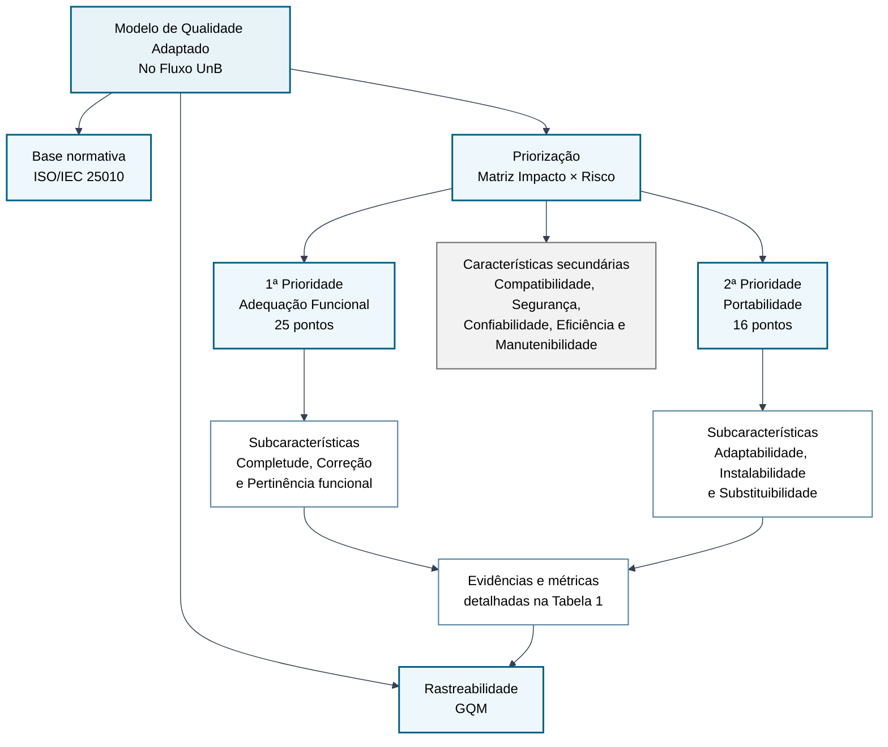

# 5. Modelo de Qualidade - No Fluxo UnB

As características de qualidade de software escolhidas para esta avaliação, com base na norma **ISO/IEC 25010 (SQuaRE)**, são:
- **Adequação Funcional**
- **Portabilidade**

---

## 5.1 Modelo de Qualidade Adaptado

A Figura 1 apresenta uma visão sintética do modelo de qualidade adaptado ao contexto do No Fluxo UnB. Os detalhes de subcaracterísticas, métricas e evidências são apresentados na Tabela 1 para manter a leitura clara.

**Figura 1: Modelo de qualidade adaptado ao No Fluxo UnB.**

*Fonte: Elaborado pelo Grupo Hedy Lamarr (2026), com base na ISO/IEC 25010, na Matriz Impacto × Risco e na abordagem GQM.*

**Tabela 1: Rastreabilidade do modelo de qualidade adaptado.**

| Característica | Subcaracterísticas | Métricas / indicadores | Itens priorizados / evidências |
|---|---|---|---|
| **Adequação Funcional** | Completude Funcional; Correção Funcional; Pertinência Funcional | Cobertura das funções essenciais; presença das funcionalidades prometidas; correção da leitura do histórico; consistência dos dados curriculares; utilidade para o estudante | Leitura correta do PDF de histórico escolar; visualização de fluxos curriculares; processamento do histórico acadêmico; identificação de pré-requisitos; orientação via chatbot; busca, filtros e exportação |
| **Portabilidade** | Adaptabilidade; Instalabilidade; Substituibilidade | Funcionamento em diferentes dispositivos; adaptação a resoluções de tela; execução em ambientes controlados; compatibilidade entre navegadores; continuidade de uso em ambientes variados | Chrome, Firefox, Safari e Edge; Windows, macOS, Linux, iOS e Android; desktop, notebook, tablet e smartphone; ambiente web acessível a estudantes da UnB |
| **Características secundárias** | Compatibilidade; Segurança; Confiabilidade; Eficiência de Desempenho; Manutenibilidade | Características consideradas na priorização, mas com menor pontuação que Adequação Funcional e Portabilidade | Podem ser analisadas em outro momento ou escopo, sem compor o foco principal desta avaliação |

*Fonte: Elaborado pelo Grupo Hedy Lamarr (2026).*

---

## 5.2 Adequação Funcional

### Motivação

Garantir que o No Fluxo UnB execute todas as suas funções essenciais de forma correta e completa. A utilidade da plataforma para os alunos da UnB depende diretamente da capacidade do sistema de:

- **Visualizar Fluxos Curriculares**: Apresentar com precisão a estrutura curricular de cada curso, incluindo disciplinas obrigatórias, optativas, pré-requisitos e sequência de oferecimento.
- **Orientação via Chatbot**: Fornecer recomendações apropriadas sobre escolha de disciplinas com base no histórico acadêmico do aluno e suas metas.
- **Integração com Dados Acadêmicos**: Manter sincronização correta com o banco de dados da UnB para obter informações atualizadas sobre as estruturas curriculares de cada curso.
- **Exportação**: Permitir que os alunos gerem relatórios.
- **Busca e Filtros**: Possibilitar buscas eficazes por disciplinas, cursos e pré-requisitos.

A confiança dos alunos no sistema é construída sobre a premissa de que cada recurso prometido funcionará como esperado, ajudando de fato na visualização e na tomada de decisão.

## 5.3 Portabilidade

### Motivação

Possibilitar que o No Fluxo UnB seja acessado e utilizado em uma ampla gama de dispositivos, navegadores e ambientes operacionais. Os alunos da UnB acessam a plataforma de:

- **Diferentes Dispositivos**: Desktops, laptops, tablets e smartphones.
- **Diversos Navegadores**: Chrome, Firefox, Safari, Edge em suas versões mais recentes.
- **Múltiplos Sistemas Operacionais**: Windows, macOS, Linux, iOS, Android.

## 5.4 Critérios de Priorização

Os critérios adotados para a escolha destas características foram:

### Impacto no Usuário Final

As características selecionadas têm um impacto direto e crítico na experiência do aluno:

- **Adequação Funcional**: Uma falha funcional (ex: recomendação incorreta de pré-requisito, dados desatualizados) pode resultar no planejamento errado do aluno em disciplinas, comprometendo seu progresso acadêmico.
- **Portabilidade**: Um aluno que acessa a plataforma via smartphone não conseguir visualizar o fluxograma ou interagir com o chatbot é excluído completamente do uso.

### Relevância para a Proposta de Valor do No Fluxo UnB

A reputação do No Fluxo UnB como ferramenta essencial para orientação acadêmica da UnB depende diretamente de:

- **Qualidade Funcional**: Recomendações confiáveis são o ponto chave da proposta de valor. Um aluno que recebe orientações incorretas não retornará à plataforma.
- **Ampla Portabilidade**: Ser acessível em qualquer dispositivo aumenta o alcance da ferramenta. Isso maximiza o impacto do software na escolha de disciplinas de mais alunos.

---

## Histórico de Versões

| Versão | Data | Descrição | Autor |
|---|---|---|---|
| `1.3` | 03/06/2026 | Ajuste de contraste do diagrama do modelo de qualidade com fundo claro e texto escuro | [Lucas Guimarães](https://github.com/lcsgborges) |
| `1.2` | 03/06/2026 | Reorganização do diagrama do modelo de qualidade para melhorar a legibilidade | [Lucas Guimarães](https://github.com/lcsgborges) |
| `1.1` | 03/06/2026 | Revisão e ajustes de acordo com a avaliação da Fase 1 feita pelos alunos da disciplina que avaliaram o Grupo Hedy Lamarr | [Lucas Guimarães](https://github.com/lcsgborges) |
