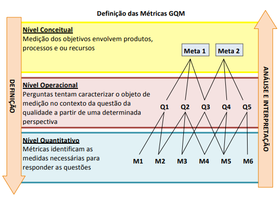
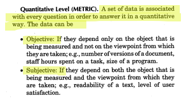
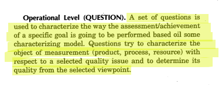
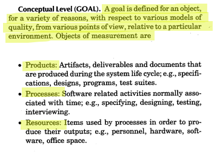

# 1. Especificação da Avaliação

## 1.1. Metodologia **GQM (Goal Question Metric)**

Para a realização da etapa de especificação da avaliação utilizaremos a metodologia GQM.

> GQM é uma abordagem de cima para baixo (top-down) para estabelecer um sistema de medição direcionado a metas para o desenvolvimento de software, em que a equipe começa com metas organizacionais, define a medição das metas, levanta questões a abordar os objetivos e identifica as métricas que proporcionem respostas às perguntas.
>
> (SILVA et al., 2009, p. 4)

  <strong>Figura 6: Definição das Métricas GQM.</strong>
   
  
   
  <em>Fonte: Silva et al. (2009, p. 4).</em>

 

Analisar o software No Fluxo UnB, uma aplicação web de apoio ao planejamento acadêmico de estudantes da Universidade de Brasília, disponível em [https://no-fluxo.crianex.com/](https://no-fluxo.crianex.com/), com o propósito de avaliar sua qualidade quanto às características de Adequação Funcional e Portabilidade, de acordo com o modelo de qualidade ISO/IEC 25010.

A versão analisada é a release [qualidade-de-software](https://github.com/lcsgborges/2025-1-NoFluxoUNB/releases/tag/qualidade-de-software), criada em 02/06/2026 no fork [lcsgborges/2025-1-NoFluxoUNB](https://github.com/lcsgborges/2025-1-NoFluxoUNB). O fork foi utilizado porque não houve êxito na comunicação com a equipe do No Fluxo UnB para criação de uma release atualizada, e a última release oficial identificada pela equipe avaliadora havia sido disponibilizada em julho de 2025, não condizendo com as atualizações feitas na plataforma em maio de 2026.

A avaliação busca verificar o grau de completude e correção das funcionalidades essenciais de leitura do histórico acadêmico, visualização do fluxograma curricular e apoio ao planejamento de disciplinas, bem como a capacidade da aplicação de operar adequadamente em diferentes ambientes de acesso.

A análise é conduzida do ponto de vista dos usuários finais e avaliadores técnicos, considerando o contexto de uso real do sistema no site de avaliação [https://no-fluxo.crianex.com/](https://no-fluxo.crianex.com/), incluindo acesso por múltiplos navegadores (Chrome, Safari e Firefox), uso em dispositivos desktop e móveis e validação das informações acadêmicas apresentadas pela plataforma.

---

## 1.2. Métricas (Q)

>Cada questão é associada a métricas que permitem responder de maneira quantitativa e verificável.
>Os dados coletados podem ser:
>- Objetivos: dependem apenas do objeto medido, como número de versões de um artefato, esforço (em horas) despendido em uma tarefa ou tamanho de um módulo de código;
>- Subjetivos: dependem tanto do objeto quanto da percepção do avaliador, como legibilidade de um documento, clareza de uma interface ou nível de satisfação do usuário.
>
>(BASILI et al., 1994, p. 529)

  <strong>Figura 7: Descrição das Métricas.</strong>
   
  
   
  <em>Fonte: Basili et al. (1994, p. 529).</em>

---

## 1.3. Questões (Q)

>Nesse estágio, um conjunto de questões orienta a forma de avaliação do objetivo definido, descrevendo como e em que medida o objeto será examinado segundo um modelo de qualidade.
>Essas perguntas buscam caracterizar o produto, processo ou recurso em relação a aspectos específicos da qualidade, permitindo compreender seu desempenho sob o ponto de vista selecionado.
>
>(BASILI et al., 1994, p. 528)

  <strong>Figura 8: Descrição das Questões.</strong>
   
  
   
  <em>Fonte: Basili et al. (1994, p. 528).</em>

---

## 1.4. Objetivos (Goals)

>Neste nível, um objetivo é feito para um determinado objeto de medição, podendo ser analisado sob diferentes perspectivas:
>- Produtos: artefatos e entregáveis gerados ao longo do ciclo de vida do sistema, como especificações, diagramas, código-fonte e casos de teste;
>- Processos: atividades relacionadas ao desenvolvimento de software, como modelagem, codificação, testes e entrevistas;
>- Recursos: elementos utilizados na execução dos processos, como equipe, hardware, software e infraestrutura de apoio.
>
>(BASILI et al., 1994, p. 528)
 
 

  <strong>Figura 9: Descrição dos Objetivos.</strong>
   
  
   
  <em>Fonte: Basili et al. (1994, p. 528).</em>

 

---

## 1.5. Escopo da Avaliação

**Tabela 15: Escopo da avaliação GQM.**

| **Elemento** | **Descrição** |
| :------------ | :------------- |
| **O que será avaliado** | O sistema **No Fluxo UnB**, disponível em [https://no-fluxo.crianex.com/](https://no-fluxo.crianex.com/), usando como marco rastreável a release [qualidade-de-software](https://github.com/lcsgborges/2025-1-NoFluxoUNB/releases/tag/qualidade-de-software), criada em 02/06/2026 no fork [lcsgborges/2025-1-NoFluxoUNB](https://github.com/lcsgborges/2025-1-NoFluxoUNB). O foco recai nas funcionalidades de **leitura e processamento do histórico acadêmico**, **visualização do fluxograma curricular** e **apoio ao planejamento de disciplinas**. |
| **O que não será avaliado** | Aspectos relacionados à **segurança da informação**, **desempenho do sistema** e **usabilidade da interface**, que podem ser abordados em outro momento ou escopo. |
| **Ambiente de teste e condições** | Testes realizados em ambiente controlado, com os seguintes parâmetros: • **Sistemas Operacionais:** Ubuntu 22.04 e Windows 11 • **Navegadores:** Google Chrome, Mozilla Firefox e Safari • **Dispositivos:** Desktop e notebook • **Conexão:** Internet banda larga estável |
| **Responsáveis e papéis** | • **Equipe de Avaliação:** autores do projeto (André Gustavo, Gabriel Lopes, Guilherme D Avila, Lucas Guimarães, Paulo Cerqueira e Vinicius de Jesus) • **Orientação e supervisão:** Profa. **Cristiane Soares Ramos** • **Responsáveis pela coleta e interpretação de métricas:** Equipe de desenvolvimento e avaliadores de qualidade |

*Fonte: Elaborado pelo Grupo Hedy Lamarr (2026).*

---

## Links para as páginas dos nossos artefatos GQM

- [1° Objetivo de Medição: Adequação Funcional](01_obj_adequacao_funcional.md)  
- [2° Objetivo de Medição: Portabilidade](02_obj_portabilidade.md)

---

## Referências

>SILVA, Carlos Vinícius Pereira da; MOURA, Déborah Carvalho de; CAMPOS, Danylo de Castro; NERY, Paulo. *GQM: Goal - Question - Metric*. 2009.
>
>BASILI, Victor R.; CALDIERA, Gianluigi; ROMBACH, H. Dieter. *Goal Question Metric Paradigm*. In: MARCINIAK, John J. (Ed.). Encyclopedia of Software Engineering - 2° Vol. New York: John Wiley & Sons, Inc., 1994. P. 528, 529.
>
>NO FLUXO UNB. *No Fluxo UnB*. Disponível em: [https://no-fluxo.crianex.com/](https://no-fluxo.crianex.com/). Acesso em: 03 jun. 2026.
>
>NO FLUXO UNB. *Release qualidade-de-software*. Fork utilizado como versão analisada. Disponível em: [https://github.com/lcsgborges/2025-1-NoFluxoUNB/releases/tag/qualidade-de-software](https://github.com/lcsgborges/2025-1-NoFluxoUNB/releases/tag/qualidade-de-software). Acesso em: 03 jun. 2026.

## Histórico de Versões

**Tabela 16: Histórico de versões da página.**

| Versão | Data       | Descrição                                                               | Autor                               |
| :----- | :--------- | :---------------------------------------------------------------------- | :---------------------------------- |
| `1.1`  | 03/06/2026 | Inclusão da release do fork utilizada como versão analisada no escopo GQM | [Lucas Guimarães](https://github.com/lcsgborges) |
| `1.0`  | 03/06/2026 | Criação da estrutura inicial da página e criação das questões e métricas da adequação funcional | [Lucas Guimarães](https://github.com/lcsgborges) |

*Fonte: Elaborado pelo Grupo Hedy Lamarr (2026).*
