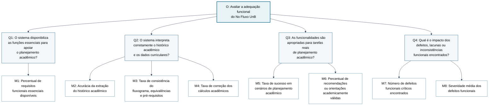

# 2. Objetivo de Medição - Adequação Funcional

Esta página especifica o objetivo de medição da característica **Adequação Funcional** do **No Fluxo UnB**, seguindo a abordagem **GQM (Goal, Question, Metric)**. A especificação deriva diretamente da Fase 1, em que Adequação Funcional foi priorizada com maior pontuação na matriz Impacto × Risco por estar relacionada ao núcleo do produto: interpretar corretamente o histórico acadêmico do estudante, cruzar esses dados com o fluxograma curricular e apoiar o planejamento da graduação.

De acordo com a ISO/IEC 25010, a Adequação Funcional envolve a capacidade de um produto prover funções que atendam às necessidades declaradas e implícitas dos usuários. No contexto do No Fluxo UnB, esta característica é analisada pelas subcaracterísticas **Completude Funcional**, **Correção Funcional** e **Pertinência Funcional**.

---

## 2.1 Objetivo de Medição

**Tabela 1: Objetivo de medição para Adequação Funcional.**

| Elemento GQM | Definição para o No Fluxo UnB |
|---|---|
| **Analisar** | O sistema **No Fluxo UnB**, com foco no motor de leitura e processamento do histórico acadêmico em PDF, na visualização do fluxograma curricular, nos cálculos acadêmicos, na simulação de planejamento e nas funcionalidades de apoio ao estudante. |
| **Com o propósito de** | Avaliar se os requisitos funcionais essenciais estão presentes, operam corretamente e são apropriados para apoiar o planejamento acadêmico de estudantes da Universidade de Brasília. |
| **Com respeito a** | **Adequação Funcional**, considerando Completude Funcional, Correção Funcional e Pertinência Funcional, conforme a ISO/IEC 25010. |
| **Do ponto de vista de** | Estudantes de graduação da UnB, equipe avaliadora do Grupo Hedy Lamarr e equipe de desenvolvimento do No Fluxo UnB. |
| **No contexto de** | Avaliação acadêmica de qualidade de produto de software na disciplina FGA0315 - Qualidade de Software 1, com base no sistema disponível em [https://no-fluxo.crianex.com/](https://no-fluxo.crianex.com/) e nos objetos de avaliação definidos na Fase 1. |

*Fonte: Elaborado pelo Grupo Hedy Lamarr (2026), com base na abordagem GQM e na ISO/IEC 25010.*

**Figura 1: Diagrama GQM para Adequação Funcional do No Fluxo UnB.**

*Fonte: Elaborado pelo Grupo Hedy Lamarr (2026), com base na abordagem GQM e no objetivo de Adequação Funcional do No Fluxo UnB.*

---

## 2.2 Folha de Abstração

A folha de abstração explicita como o objetivo será interpretado antes da coleta dos dados. Ela reduz ambiguidades entre o que será medido, por que será medido e como os resultados serão julgados.

**Tabela 2: Folha de abstração do objetivo de Adequação Funcional.**

| Campo | Descrição |
|---|---|
| **Objeto** | Produto de software No Fluxo UnB, especialmente os módulos de leitura do histórico, processamento acadêmico, visualização do fluxograma, simulação de planejamento, exportação e apoio por assistente de IA. |
| **Propósito** | Avaliar a capacidade do sistema de entregar as funções esperadas para apoiar o planejamento acadêmico. |
| **Foco da qualidade** | Adequação Funcional: completude, correção e pertinência das funções. |
| **Ponto de vista** | Usuário final estudante, avaliadores de qualidade e equipe mantenedora do produto. |
| **Contexto de uso** | Estudantes da UnB acessando a aplicação web para interpretar histórico acadêmico, consultar fluxograma, verificar progresso e planejar disciplinas. |
| **Hipótese global** | Se o sistema apresentar alta cobertura de funções essenciais, acurácia mínima de 95% na leitura do histórico e baixa ocorrência de defeitos críticos, então a Adequação Funcional será considerada suficiente para apoiar decisões acadêmicas com confiança. |
| **Fatores de variação** | Curso avaliado, formato do histórico em PDF, versão da base curricular, navegador utilizado, disponibilidade dos serviços externos e estado da autenticação do usuário. |
| **Restrições da avaliação** | A avaliação não pretende validar todos os cursos, todos os modelos possíveis de histórico nem todos os cenários de exceção da UnB. O escopo fica limitado aos objetos e ambientes definidos na Fase 1. |

*Fonte: Elaborado pelo Grupo Hedy Lamarr (2026).*

---

## 2.3 Rastreabilidade com a Fase 1

A Tabela 3 apresenta a relação direta entre as decisões tomadas na Fase 1 e o desdobramento deste objetivo GQM.

**Tabela 3: Rastreabilidade entre Fase 1 e objetivo de Adequação Funcional.**

| Definição da Fase 1 | Relação com este objetivo GQM |
|---|---|
| Adequação Funcional foi a característica de maior prioridade na matriz Impacto × Risco, com 25 pontos. | O objetivo de medição verifica se as funções centrais estão completas, corretas e úteis para o estudante. |
| O propósito da avaliação é apoiar decisões técnicas e de evolução do No Fluxo UnB. | As métricas foram definidas para produzir evidências acionáveis sobre falhas funcionais, lacunas e riscos de uso. |
| O motor de leitura do histórico em PDF foi identificado como núcleo funcional do sistema. | A métrica M2 mede a acurácia da extração do histórico, com limite mínimo alinhado à exigência de 95% mencionada na Fase 1. |
| A visualização do fluxograma e o apoio ao planejamento acadêmico foram definidos como funções centrais. | As métricas M3, M4, M5 e M6 avaliam consistência curricular, cálculos acadêmicos e conclusão de tarefas de planejamento. |
| O público-alvo principal são estudantes de graduação da UnB. | As questões avaliam se o sistema entrega valor funcional do ponto de vista do estudante que precisa planejar sua trajetória acadêmica. |

*Fonte: Elaborado pelo Grupo Hedy Lamarr (2026).*

---

## 2.4 Questões e Hipóteses

As questões foram formuladas para cobrir as três subcaracterísticas de Adequação Funcional presentes na ISO/IEC 25010. Cada questão possui uma hipótese associada, que será confrontada com os resultados obtidos na execução da avaliação.

**Tabela 4: Questões e hipóteses do objetivo de Adequação Funcional.**

| Código | Questão | Subcaracterística | Hipótese |
|---|---|---|---|
| **Q1** | Em que medida o No Fluxo UnB disponibiliza os requisitos funcionais essenciais para apoiar o planejamento acadêmico do estudante? | Completude Funcional | **H1:** O sistema disponibiliza pelo menos 90% dos requisitos funcionais essenciais identificados na Fase 1 e no levantamento de requisitos do produto. |
| **Q2** | Com que precisão o sistema interpreta o histórico acadêmico e apresenta informações curriculares corretas ao estudante? | Correção Funcional | **H2:** A leitura do histórico e a apresentação dos dados curriculares atingem acurácia igual ou superior a 95%, sem defeitos críticos que comprometam a decisão acadêmica. |
| **Q3** | Em que grau as funcionalidades do sistema são apropriadas para executar tarefas reais de planejamento acadêmico? | Pertinência Funcional | **H3:** Os cenários principais de planejamento podem ser concluídos com sucesso em pelo menos 90% das execuções avaliadas. |
| **Q4** | Qual é o impacto dos defeitos, lacunas ou inconsistências funcionais encontrados durante a avaliação? | Adequação Funcional consolidada | **H4:** Os defeitos funcionais encontrados terão severidade média baixa ou moderada, sem ocorrência de mais de um defeito crítico. |

*Fonte: Elaborado pelo Grupo Hedy Lamarr (2026).*

---

## 2.5 Métricas Selecionadas

As métricas abaixo respondem diretamente às questões da Seção 2.4. Foram priorizadas métricas simples, objetivas e verificáveis, com fórmulas explícitas e fontes de evidência auditáveis.

**Tabela 5: Métricas do objetivo de Adequação Funcional.**

| Código | Questão | Métrica | Tipo | Fórmula / forma de medição | Fonte de evidência |
|---|---|---|---|---|---|
| **M1** | Q1 | Percentual de requisitos funcionais essenciais disponíveis | Quantitativa | `(Nº de requisitos funcionais essenciais disponíveis e acessíveis / Nº total de requisitos funcionais essenciais definidos na Tabela 6) × 100` | Checklist funcional derivado de `documentacao/requisitos.md` e execução exploratória da aplicação. |
| **M2** | Q2 | Acurácia da extração do histórico acadêmico | Quantitativa | `(Nº de informações do histórico extraídas corretamente / Nº total de informações esperadas no histórico de referência) × 100` | Históricos em PDF e textos extraídos de `test_historicos/`, dados extraídos pelo sistema e conferência com valores esperados dos scripts de teste. |
| **M3** | Q2 | Taxa de consistência do fluxograma, equivalências e pré-requisitos | Quantitativa | `(Nº de disciplinas, equivalências, dependências e pré-requisitos exibidos corretamente / Nº total de itens curriculares verificados) × 100` | Base curricular, consultas de matrizes/disciplinas/equivalências, tela gerada pelo No Fluxo UnB e registros de verificação. |
| **M4** | Q2 | Taxa de correção dos cálculos acadêmicos | Quantitativa | `(Nº de indicadores acadêmicos calculados corretamente / Nº total de indicadores acadêmicos verificados) × 100` | Valores esperados de curso, IRA, média ponderada, suspensões, pendências, integralização e progresso, conferidos com histórico e base curricular. |
| **M5** | Q3 | Taxa de sucesso em cenários de planejamento acadêmico | Quantitativa | `(Nº de cenários concluídos sem impedimento funcional / Nº total de cenários executados) × 100` | Roteiros de teste, evidências de execução, registros de sucesso e falha. |
| **M6** | Q3 | Percentual de recomendações ou orientações academicamente válidas | Quantitativa | `(Nº de recomendações válidas / Nº total de recomendações avaliadas) × 100` | Respostas do assistente de IA, histórico de referência, ementas ou informações curriculares disponíveis e regras acadêmicas aplicáveis. |
| **M7** | Q4 | Número de defeitos funcionais críticos encontrados | Quantitativa | Contagem de defeitos classificados como críticos, isto é, defeitos capazes de induzir uma decisão acadêmica incorreta ou impedir o uso de uma função central. | Registro de defeitos, evidências de reprodução e classificação de severidade. |
| **M8** | Q4 | Severidade média dos defeitos funcionais | Quantitativa ordinal | `Soma das severidades atribuídas aos defeitos / Nº total de defeitos funcionais encontrados`, em escala de 1 a 5. | Registro de defeitos funcionais e escala de severidade definida nesta página. |

*Fonte: Elaborado pelo Grupo Hedy Lamarr (2026).*

### 2.5.1 Requisitos Funcionais Essenciais Esperados

Para a métrica M1, o conjunto de requisitos funcionais essenciais foi definido com base na descrição do produto da Fase 1 e no arquivo `documentacao/requisitos.md` do repositório de referência do No Fluxo UnB.

**Tabela 6: Requisitos funcionais essenciais considerados na métrica M1.**

| Código | Requisito funcional essencial | Justificativa |
|---|---|---|
| **F1** | Upload e leitura de histórico acadêmico em PDF | É a entrada principal para personalizar a análise do estudante. |
| **F2** | Extração de disciplinas cursadas, aprovadas e reprovadas | Permite identificar o estado acadêmico real do usuário. |
| **F3** | Consulta ao banco de dados de fluxograma, disciplinas e equivalências | Conecta o histórico do estudante à matriz curricular oficial usada pela plataforma. |
| **F4** | Visualização do fluxograma curricular do curso com disciplinas cursadas destacadas | É a entrega visual central da plataforma. |
| **F5** | Exibição de equivalências e dependências curriculares | Apoia a escolha correta de disciplinas futuras. |
| **F6** | Indicação de número de reprovações ou tentativas por disciplina | Ajuda o estudante a compreender seu percurso no curso. |
| **F7** | Cálculo de progresso acadêmico, IRA, média ponderada e carga horária | Permite acompanhar a situação acadêmica de forma objetiva. |
| **F8** | Identificação de horas complementares cumpridas e pendentes | Evita planejamento incompleto em relação à integralização curricular. |
| **F9** | Planejamento ou simulação de disciplinas futuras | Relaciona diretamente o sistema ao planejamento acadêmico personalizado. |
| **F10** | Exportação em PDF da simulação do fluxograma | Permite registrar e compartilhar o planejamento em formato padronizado. |
| **F11** | Simulação de troca de curso e aproveitamento de disciplinas | Atende cenário de decisão acadêmica relevante. |
| **F12** | Persistência de dados e simulações para usuário logado | Permite continuidade de uso e comparação de planejamentos. |
| **F13** | Cálculo de semestres cursados e restantes | Ajuda o estudante a estimar sua trajetória até a conclusão. |
| **F14** | Identificação de trancamentos e mudanças de curso no histórico | Evita interpretação incompleta do percurso acadêmico. |
| **F15** | Assistente de IA para apoio à escolha de cursos e disciplinas | Complementa a tomada de decisão com recomendações alinhadas a interesses, histórico e matriz curricular. |

*Fonte: Elaborado pelo Grupo Hedy Lamarr (2026), com base na descrição do produto e em `documentacao/requisitos.md` do No Fluxo UnB.*

---

## Referências

> BASILI, Victor R.; CALDIERA, Gianluigi; ROMBACH, H. Dieter. *Goal Question Metric Paradigm*. In: MARCINIAK, John J. (Ed.). *Encyclopedia of Software Engineering*. New York: John Wiley & Sons, 1994.
>
> INTERNATIONAL ORGANIZATION FOR STANDARDIZATION. *ISO/IEC 25010:2011 - Systems and software engineering - Systems and software Quality Requirements and Evaluation (SQuaRE) - System and software quality models*. Geneva: ISO, 2011.
>
> NO FLUXO UNB. *No Fluxo UnB*. Disponível em: [https://no-fluxo.crianex.com/](https://no-fluxo.crianex.com/). Acesso em: 03 jun. 2026.
>
> NO FLUXO UNB. *Levantamento de Requisitos*. Repositório público do No Fluxo UnB. Disponível em: [https://github.com/unb-mds/2025-1-NoFluxoUNB/blob/main/documentacao/requisitos.md](https://github.com/unb-mds/2025-1-NoFluxoUNB/blob/main/documentacao/requisitos.md). Acesso em: 03 jun. 2026.
>
> FCTE QUALIDADE DE SOFTWARE 1. *2025-2 T01 Heddy Lamar - Objetivo de Medição: Adequação Funcional*. Disponível em: [https://fcte-qualidade-de-software-1.github.io/2025-2_T01_HEDDY-LAMAR/fase_2/obj_adequacao_funcional/](https://fcte-qualidade-de-software-1.github.io/2025-2_T01_HEDDY-LAMAR/fase_2/obj_adequacao_funcional/). Acesso em: 03 jun. 2026.
>
> FCTE QUALIDADE DE SOFTWARE 1. *2025-2 T02 Radia Perlman - Característica: Adequação Funcional*. Disponível em: [https://fcte-qualidade-de-software-1.github.io/2025-2_T02_Radia_Perlman/fase2/02_adequacao_funcional/](https://fcte-qualidade-de-software-1.github.io/2025-2_T02_Radia_Perlman/fase2/02_adequacao_funcional/). Acesso em: 03 jun. 2026.

---

## Histórico de Versões

**Tabela 12: Histórico de versões da página.**

| Versão | Data | Descrição | Autor | Revisor |
|---|---|---|---|---|
| `1.2` | 03/06/2026 | Inclusão do diagrama GQM em Mermaid para o objetivo de Adequação Funcional do No Fluxo UnB. | [Lucas Guimarães](https://github.com/lcsgborges) | Grupo Hedy Lamarr |
| `1.1` | 03/06/2026 | Refinamento com base no levantamento de requisitos do No Fluxo UnB, nos testes de histórico disponíveis no repositório e na definição de evidências auditáveis por métrica. | [Lucas Guimarães](https://github.com/lcsgborges) | Grupo Hedy Lamarr |
| `1.0` | 03/06/2026 | Criação do objetivo de medição de Adequação Funcional, com objetivo GQM, folha de abstração, rastreabilidade com a Fase 1, questões, hipóteses | [Gabriel Amorim](https://github.com/BrzGab) | Grupo Hedy Lamarr |

*Fonte: Elaborado pelo Grupo Hedy Lamarr (2026).*
