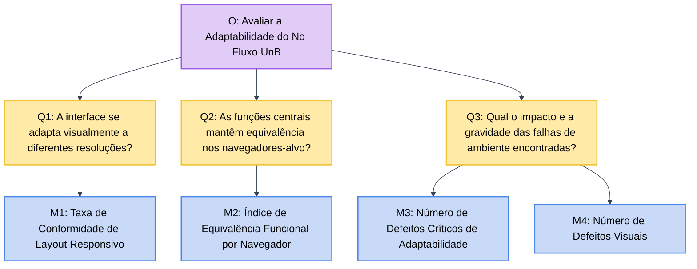

# 3. Objetivo de Medição - Portabilidade

Esta página especifica o objetivo de medição da característica **Portabilidade** do No Fluxo UnB, seguindo a abordagem **GQM (Goal, Question, Metric)**. A especificação deriva diretamente da Fase 1, em que Portabilidade foi selecionada na matriz Impacto × Risco por estar relacionada à capacidade do sistema de atender estudantes da UnB em diferentes ambientes de acesso: distintos navegadores, sistemas operacionais, tipos de dispositivo e resoluções de tela.

De acordo com a ISO/IEC 25010, a Portabilidade envolve a capacidade de um produto ou sistema ser transferido de forma eficaz e eficiente de um ambiente de hardware, software ou outro ambiente operacional para outro. No contexto do No Fluxo UnB, esta característica é analisada pela subcaracterística **Adaptabilidade**.

---

## 3.1 Objetivo de Medição

**Tabela 24: Objetivo de medição para Portabilidade.**

| Elemento GQM | Definição para o No Fluxo UnB |
|---|---|
| **Analisar** | O sistema **No Fluxo UnB**, disponível em https://no-fluxo.crianex.com/, com foco na interface web da aplicação — incluindo o módulo de visualização do fluxograma, o módulo de leitura e processamento do histórico acadêmico e a interface web responsiva —, avaliando seu funcionamento em diferentes navegadores, sistemas operacionais, tipos de dispositivo e resoluções de tela. |
| **Com o propósito de** | Avaliar se a aplicação opera de forma adequada em diferentes ambientes de acesso, verificando a consistência visual, funcional e de responsividade da interface em cenários de uso variados por estudantes da UnB — em navegadores web, dispositivos desktop, notebook e smartphone. |
| **Com respeito a** | **Portabilidade**, considerando a subcaracterística de **Adaptabilidade** (capacidade de adaptação a diferentes ambientes de hardware, software e sistema operacional), conforme a ISO/IEC 25010. |
| **Do ponto de vista de** | Estudantes de graduação da UnB que acessam a plataforma a partir de diferentes dispositivos e ambientes, equipe avaliadora do Grupo Hedy Lamarr e equipe de desenvolvimento do No Fluxo UnB. |
| **No contexto de** | Avaliação acadêmica de qualidade de produto de software na disciplina FGA0315 — Qualidade de Software 1, com base na release **qualidade-de-software** (02/06/2026), em ambiente controlado com as configurações da Tabela 30. |

*Fonte: Elaborado pelo Grupo Hedy Lamarr (2026), com base na abordagem GQM e na ISO/IEC 25010.*

---

## 3.2 Folha de Abstração

A folha de abstração explicita como o objetivo será interpretado antes da coleta dos dados. Ela reduz ambiguidades entre o que será medido, por que será medido e como os resultados serão julgados.

**Tabela 25: Folha de abstração do objetivo de Portabilidade.**

| Campo | Descrição |
|---|---|
| **Objeto** | Produto de software No Fluxo UnB, especificamente: o **módulo de visualização do fluxograma** (exibição interativa de disciplinas, dependências e equivalências); o **módulo de leitura e processamento do histórico** (extração de dados do PDF acadêmico); e a **interface web responsiva**. |
| **Propósito** | Verificar se a aplicação mantém funcionamento adequado, consistência visual e usabilidade aceitável quando acessada em diferentes ambientes de software e hardware, sem exigir configurações especiais por parte do usuário. |
| **Foco da qualidade** | Portabilidade: adaptabilidade da interface a diferentes navegadores, sistemas operacionais, tipos de dispositivo e resoluções de tela variadas, assegurando continuidade de uso em ambientes web acessíveis a estudantes da UnB. |
| **Ponto de vista** | Usuário final estudante que acessa a plataforma a partir de seu próprio dispositivo e navegador, sem configuração prévia; avaliadores de qualidade que executam os testes em ambiente controlado. |
| **Contexto de uso** | Estudantes da UnB acessando a aplicação web para realizar tarefas de planejamento acadêmico — upload de histórico, consulta ao fluxograma, simulação de disciplinas — a partir de equipamentos pessoais variados: dispositivos desktop e notebook com Windows ou Linux, e dispositivos móveis com iOS ou Android, nos navegadores Chrome, Firefox, Safari e Edge. |
| **Hipótese global** | Se a aplicação apresentar taxa de compatibilidade funcional igual ou superior a 90% nos navegadores e sistemas operacionais definidos no escopo, e se a interface se adaptar adequadamente às resoluções e tipos de dispositivo testados sem perdas críticas de funcionalidade ou legibilidade, então a Portabilidade será considerada satisfatória para o perfil de uso dos estudantes da UnB. |
| **Fatores de variação** | Versão e motor de renderização do navegador utilizado; resolução; sistema operacional. |
| **Restrições da avaliação** | A avaliação não contempla navegadores fora do escopo definido (ex.: Opera, Samsung Internet), versões legadas de navegadores, ambientes offline, aspectos de desempenho de rede ou tempo de carregamento, nem a avaliação do backend e infraestrutura (DigitalOcean, Vercel, Supabase) como objetos diretos de portabilidade. O escopo fica limitado aos ambientes e condições definidos na Tabela 15 da seção 1.5 da Aplicação GQM e nos itens priorizados da Tabela 12 de rastreabilidade do modelo de qualidade adaptado. |

*Fonte: Elaborado pelo Grupo Hedy Lamarr (2026), com base na abordagem GQM e na ISO/IEC 25010.*

---

## 3.3 Rastreabilidade com a Fase 1

A Tabela 26 assegura a conexão contínua e auditável entre o planejamento inicial da Fase 1 e o desdobramento do presente objetivo GQM.

**Tabela 26: Rastreabilidade entre Fase 1 e objetivo de Portabilidade.**

| Definição da Fase 1 | Relação com este objetivo GQM |
|---|---|
| Portabilidade obteve a segunda maior prioridade (16 pontos) na matriz. | O objetivo foca estritamente em responder se o sistema atende a todos os estudantes de forma multiplataforma. |
| Definição dos navegadores e SOs prioritários (Chrome, Firefox, Safari, Edge; Windows, Linux, Android e iOS). | O plano de testes e as métricas de conformidade (M2, M3) usam exatamente esse conjunto como universo amostral de validação. |
| Identificação da criticidade do acesso via smartphones por estudantes. | Inclusão de métricas e questões específicas voltadas para a adaptabilidade em dispositivos móveis e resoluções restritas. |

*Fonte: Elaborado pelo Grupo Hedy Lamarr (2026).*

---

## 3.4 Questões e Hipóteses

As questões foram formuladas para cobrir a subcaracterística **Adaptabilidade** da característica **Portabilidade** presente na ISO/IEC 25010. Cada questão possui uma hipótese associada, que será confrontada com os resultados obtidos na execução da avaliação.

**Tabela 27: Questões e Hipóteses.**

| Código | Questão | Subcaracterística / Vertente | Hipótese |
|---|---|---|---|
| **Q1** | A interface do No Fluxo UnB se adapta visualmente de forma correta a diferentes resoluções sem quebras ou sobreposições de layout? | Adaptabilidade Visual | **H1:** O índice de conformidade visual do layout adaptado é de no mínimo 90% nas resoluções críticas testadas. |
| **Q2** | As três funcionalidades essenciais (upload, fluxograma e chatbot) mantêm a equivalência de execução em todos os navegadores-alvo homologados? | Adaptabilidade Funcional | **H2:** As funções centrais alcançam 100% de sucesso operacional em todas as variantes de navegadores definidos no escopo da avaliação. |
| **Q3** | Qual é o impacto e a gravidade dos defeitos de portabilidade ou incompatibilidade de ambiente encontrados durante a avaliação? | Adaptabilidade Consolidada | **H3:** Não serão identificados defeitos de adaptabilidade com classificação de severidade crítica (que causem bloqueio total do sistema em um ecossistema específico). |

*Fonte: Elaborado pelo Grupo Hedy Lamarr (2026).*

---

## 3.5 Métricas Selecionadas

As métricas abaixo respondem diretamente às questões da Seção 3.4. Foram priorizadas métricas quantitativas, objetivas e verificáveis, com fórmulas explícitas e fontes de evidência auditáveis.

**Tabela 28: Métricas do objetivo de Portabilidade (Adaptabilidade).**

| Código | Questão | Métrica | Tipo | Fórmula / Forma de Medição | Fonte de Evidência |
|---|---|---|---|---|---|
| **M1** | Q1 | Taxa de conformidade de layout responsivo | Quantitativa | `(Nº de resoluções sem quebra / Nº de resoluções total testadas) × 100` | Inspeção visual e capturas de tela das páginas principais nos dispositivos. |
| **M2** | Q2 | Índice de equivalência funcional por navegador | Quantitativa | `(Nº de funcionalidades (Tabela 29) funcionando no navegador / 3 (Nº total de funcionalidades)) × 100` | Execução cruzada de roteiros de testes operacionais nos navegadores Chrome, Firefox, Safari e Edge. |
| **M3** | Q3 | Número de defeitos críticos de adaptabilidade encontrados | Quantitativa | Contagem de defeitos de portabilidade que causam impossibilidade de uso de uma função central em um ambiente específico. | Registro de defeitos (print ou vídeo), relatório da descrição do defeito e nº total. |
| **M4** | Q3 | Número de defeitos visuais | Quantitativa | Contagem de falhas de layout ou pequenas anomalias estéticas. | Registro de defeitos (print ou vídeo), relatório da descrição do defeito e nº total. |

*Fonte: Elaborado pelo Grupo Hedy Lamarr (2026).*

### Tabela 29: Funcionalidades Centrais

| Funcionalidade | Descrição |
|---|---|
| Leitura e Processamento do Histórico | Capacidade de fazer o upload do histórico acadêmico e extrair os dados. |
| Visualização do Fluxograma | Exibição interativa das matérias e equivalências na tela. |
| Assistente de Inteligência Artificial (Chatbot) | Interação e retorno de sugestões. |

*Fonte: Elaborado pelo Grupo Hedy Lamarr (2026).*

---

## 3.6 Diagrama GQM para Portabilidade

**Diagrama 1: Diagrama GQM para Portabilidade.**

*Fonte: IA com base na abordagem GQM e no objetivo de Portabilidade do No Fluxo UnB definidos neste documento.*

---

## 3.7 Matriz de Ambientes Homologados para Teste (Métricas M2 e M3)

Para a realização padronizada das medições de Portabilidade, os testes devem cobrir obrigatoriamente as combinações da Tabela 30, estabelecidas a partir dos requisitos de escopo da Fase 1.

**Tabela 30: Matriz de Ambientes Alvo de Homologação.**

| ID Ambiente | Categoria | Sistema Operacional Base (Versão) | Navegador Alvo (Versão Estável) | Resolução de Referência |
|---|---|---|---|---|
| ENV-01 | Desktop | Windows 11 (25H2) | Google Chrome v148.0.7778.217 | 1920 × 1080 |
| ENV-02 | Desktop | Windows 11 (25H2) | Microsoft Edge v148.0.3967.96 | 1920 × 1080 |
| ENV-03 | Desktop | Linux Ubuntu 24.04 LTS | Mozilla Firefox v148.x | 1920 × 1080 |
| ENV-04 | Desktop | Linux Ubuntu 24.04 LTS | Google Chrome v148.0.7778.217 | 1920 × 1080 |
| ENV-05 | Mobile | Android 16 | Google Chrome v148.0.7778.217 | 2712 × 1220 |
| ENV-06 | Mobile | iOS 15 (iPhone SE geração 1) | Safari Mobile v15 | 1136 × 640 |

*Fonte: IA com base nos ambientes descritos na Fase 1 e adequação por meio do Grupo Hedy Lamarr (2026).*

---

## 3.8 Critérios de Julgamento e Interpretação dos Resultados

Para viabilizar uma interpretação inequívoca e rigorosa dos dados coletados, as faixas de pontuação e os critérios de aceitabilidade por métrica são definidos a seguir.

### M1 — Taxa de Conformidade de Layout Responsivo

| Classificação | Critério |
|---|---|
| Excelente | M1 > 90% das resoluções testadas sem quebras visuais. |
| Satisfatório | 80% <= M1 <= 90% das resoluções testadas sem quebras visuais. |
| Insuficiente | M1 < 80% das resoluções testadas (indica falha crítica de responsividade). |

### M2 — Índice de Equivalência Funcional por Navegador/Ambiente

**Observação:** O cálculo deve ser executado separadamente para cada ID de Ambiente (ENV-01 a ENV-06).

| Classificação | Critério |
|---|---|
| Excelente | M2 = 100% em todos os ambientes individualmente. |
| Satisfatório | M2 < 100% em apenas 1 ambiente testado. |
| Insuficiente | M2 < 100% em mais de 1 ambiente testado. |

### M3 — Número de Defeitos Críticos de Adaptabilidade Encontrados

| Classificação | Critério |
|---|---|
| Excelente / Satisfatório | M3 = 0 defeitos críticos encontrados. |
| Insuficiente | M3 ≥ 1 defeito crítico encontrado. |

### M4 — Número de Defeitos Visuais/Estéticos Encontrados

| Classificação | Critério |
|---|---|
| Excelente | Contagem total ≤ 2 defeitos leves no somatório de todos os testes. |
| Satisfatório | 3 ≤ Contagem total ≤ 5 de defeitos leves. |
| Insuficiente | Contagem total > 5 defeitos leves. |

**Defeitos leves:** falhas que não afetem as três funcionalidades principais do sistema.

---

## Referências

> BASILI, Victor R.; CALDIERA, Gianluigi; ROMBACH, H. Dieter. *Goal Question Metric Paradigm*. In: MARCINIAK, John J. (Ed.). *Encyclopedia of Software Engineering*. New York: John Wiley & Sons, 1994.
>
> INTERNATIONAL ORGANIZATION FOR STANDARDIZATION. *ISO/IEC 25010:2011 - Systems and software engineering - Systems and software Quality Requirements and Evaluation (SQuaRE) - System and software quality models*. Geneva: ISO, 2011.
>
> NO FLUXO UNB. *No Fluxo UnB*. Disponível em: <https://no-fluxo.crianex.com/>. Acesso em: 04 jun. 2026.
>
> GRUPO HEDY LAMARR. *Relatório Técnico de Qualidade de Software - No Fluxo UnB (Fase 1)*. FGA/UnB, 2026.

---

## Histórico de Versões

**Tabela 31: Histórico de versões da seção de Portabilidade.**

| Versão | Data | Descrição | Autor |
|---|---|---|---|
| `1.0` | 04/06/2026 | Criação do objetivo de medição de Portabilidade, com definição da folha de abstração, matriz de ambientes, mapeamento GQM e diagrama em Mermaid. | Guilherme, André, Vinícius |

*Fonte: Elaborado pelo Grupo Hedy Lamarr (2026).*
