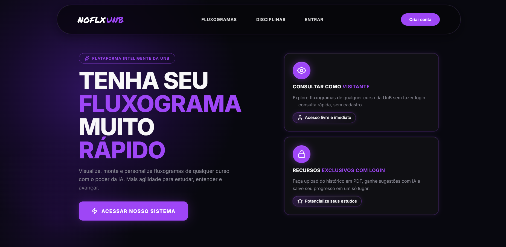

# Início

> FGA0315 - QUALIDADE DE SOFTWARE 1 - T01 (2026.1)

Este projeto tem como objetivo documentar a Avaliação da Qualidade de Produto de Software do sistema “No Fluxo UnB”, disponível em: [https://no-fluxo.crianex.com](https://no-fluxo.crianex.com)

<figure align="center">
  
  <figcaption><strong>Figura 1: Página inicial do No Fluxo UnB.</strong> <em>Fonte: No Fluxo UnB (2026).</em></figcaption>
</figure>

## Links de Rastreabilidade

**Tabela 1: Links de rastreabilidade do projeto.**

| Item | Link |
|---|---|
| Repositório da disciplina | [FCTE-Qualidade-de-Software-1/2026-1_T01_HEDY_LAMAR](https://github.com/FCTE-Qualidade-de-Software-1/2026-1_T01_HEDY_LAMAR) |
| Release da Entrega 1 | [https://github.com/FCTE-Qualidade-de-Software-1/2026-1_T01_HEDY_LAMAR/releases/tag/releases](https://github.com/FCTE-Qualidade-de-Software-1/2026-1_T01_HEDY_LAMAR/releases/tag/releases) |
| Release da Entrega 2 | [https://github.com/FCTE-Qualidade-de-Software-1/2026-1_T01_HEDY_LAMAR/releases/tag/entrega2](https://github.com/FCTE-Qualidade-de-Software-1/2026-1_T01_HEDY_LAMAR/releases/tag/entrega2) |
| Git Pages | [https://fcte-qualidade-de-software-1.github.io/2026-1_T01_HEDY_LAMAR/](https://fcte-qualidade-de-software-1.github.io/2026-1_T01_HEDY_LAMAR/) |
| Site No Fluxo UnB | [https://no-fluxo.crianex.com/](https://no-fluxo.crianex.com/) |
| Repositório do No Fluxo UnB | [unb-mds/2025-1-NoFluxoUNB](https://github.com/unb-mds/2025-1-NoFluxoUNB) |
| Fork utilizado para a avaliação | [lcsgborges/2025-1-NoFluxoUNB](https://github.com/lcsgborges/2025-1-NoFluxoUNB) |
| Release do software analisado | [qualidade-de-software](https://github.com/lcsgborges/2025-1-NoFluxoUNB/releases/tag/qualidade-de-software) |
| Declaração de Uso de IA | [Apêndice - Declaração de Uso de IA](declaracao_uso_ia.md) |
| Tabela de Contribuição | [Apêndice - Tabela de Contribuição](extras/contribuicao.md) |
| Lista de Figuras | [Apêndice - Lista de Figuras](extras/listas.md#lista-de-figuras) |
| Lista de Tabelas | [Apêndice - Lista de Tabelas](extras/listas.md#lista-de-tabelas) |
| Lista de Elementos Similares | [Apêndice - Elementos Similares](extras/listas.md#elementos-similares) |
| Referências | [Referências](referencias.md) |

*Fonte: Elaborado pelo Grupo Hedy Lamarr (2026).*

A release do fork foi adotada como versão analisada porque a última release oficial disponibilizada pela equipe do No Fluxo UnB foi publicada em julho de 2025 e não condiz com as atualizações feitas na plataforma em maio de 2026. Como não houve êxito na comunicação para solicitar uma release oficial atualizada, o Grupo Hedy Lamarr criou a release [qualidade-de-software](https://github.com/lcsgborges/2025-1-NoFluxoUNB/releases/tag/qualidade-de-software), em 02/06/2026, para manter um marco rastreável da avaliação.

## Hedy Lamarr

Hedy Lamarr foi uma atriz e inventora austríaco-americana nascida em 1914. Ela ficou famosa em Hollywood nas décadas de 1930 e 1940, sendo considerada uma das grandes estrelas do cinema da época. Além da carreira artística, Hedy também contribuiu para a tecnologia. Durante a Segunda Guerra Mundial, ajudou a desenvolver um sistema de comunicação por salto de frequência (*frequency hopping*), criado para evitar a interceptação de torpedos guiados por rádio. Sua invenção serviu de base para tecnologias modernas de comunicação sem fio, como Wi-Fi, Bluetooth e GPS.

<figure align="center">
  
  <figcaption><strong>Figura 2: Hedy Lamarr.</strong> <em>Fonte: Arquivo do projeto (2026).</em></figcaption>
</figure>

## Integrantes

  <strong>Tabela 2: Integrantes do Grupo Hedy Lamarr.</strong>
    
  <table align="center">
    <tr>
      <td align="center">
         
        
          <b>
            <a href="https://github.com/AndreGustavoRN" target="_blank" rel="noopener noreferrer">André Gustavo</a>
          </b>
         
      </td>
      <td align="center">
         
        
          <b>
            <a href="https://github.com/BrzGab" target="_blank" rel="noopener noreferrer">Gabriel Lopes</a>
          </b>
         
      </td>
      <td align="center">
         
        
          <b>
            <a href="https://github.com/GuilhermeDavila" target="_blank" rel="noopener noreferrer">Guilherme D Avila</a>
          </b>
         
      </td>
      <td align="center">
         
        
          <b>
            <a href="https://github.com/lcsgborges" target="_blank" rel="noopener noreferrer">Lucas Guimarães</a>
          </b>
         
      </td>
      <td align="center">
         
        
          <b>
            <a href="https://github.com/paulocerqr" target="_blank" rel="noopener noreferrer">Paulo Cerqueira</a>
          </b>
         
      </td>
      <td align="center">
         
        
          <b>
            <a href="https://github.com/UnderwaterVillager" target="_blank" rel="noopener noreferrer">Vinicius de Jesus</a>
          </b>
         
      </td>
    </tr>
  </table>
  <em>Fonte: Elaborado pelo Grupo Hedy Lamarr (2026).</em>

